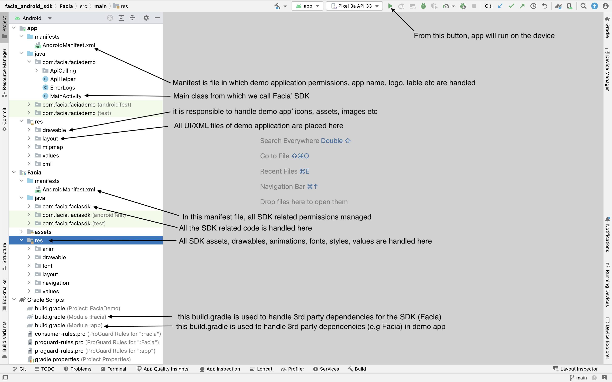

<h1 align="center">Facia Android Core SDK</h1>

## Table of contents

- [1. Introduction](#1-introduction)
  - [1. 3D Liveness](#1-3d-liveness)
  - [2. Match to Photo ID](#2-match-to-photo-id)
- [2. Scope](#2-scope)
- [3. Purpose](#3-purpose)
- [4. Technology Stack](#4-technology-stack)
    - [4.1 Supported Platform](#41-supported-platform)
    - [4.2 General Requirements](#42-general-requirements)
    - [4.3 Permissions](#43-permissions)
    - [4.4 Development Environment Setup](#44-development-environment-setup)
    - [4.5 Installation](#45-installation)
    - [4.6 Development Structure](#46-development-structure)
    - [4.7 Code Architecture](#47-code-architecture)
    - [4.8 Branches](#48-branches)
- [5. Features/EndPoints](#5-featuresendpoints)
    - [5.1 Create Transaction API](#51-create-transaction-api)
    - [5.2 Check Liveness API](#52-check-liveness-api)
    - [5.3 Liveness Result API](#53-liveness-result-api)
    - [5.4 Feedback API](#54-feedback-api)
- [6. Dependencies](#6-dependencies)
- [7. Environments](#7-environments)
- [8. Revision History](#8-revision-history)

# 1. Introduction
This is the simplest and basic Android SDK which provides 3D Liveness & Match to Photo ID features. SDK captures proofs for the required feature and sends to the API to get the result.

This SDK provides two types of verification:

[//]: # (- <b>3D Liveness</b>)

[//]: # ()
[//]: # (- <b>Match to photo ID</b>)

## 1. 3D Liveness 
Facia will detect user's face and after capturing proof it will send the request to the API to check Face Liveness, this request maybe of Quick Liveness, Detailed Liveness, Additional Liveness or Default Liveness.

The SDK provides 4 types of 3D Liveness Verification: 
**Quick Liveness** 
SDK will capture a single frame after detecting the face and will send it to API for checking Liveness. 

**Detailed Liveness** 
SDK will record a video after detecting the face and will send it to API for checking Liveness. 

**Additional Liveness** 
SDK will capture a single frame and will check its liveness through API, if liveness is rejected it will move to the Additional Liveness. 

**Default Liveness** 
SDK will work as Additional liveness if the device is not rooted, if the device is rooted, it will take the user directly to the detailed liveness.

## 2. Match to Photo ID
SDK will verify the Liveness through Quick Liveness process, if liveness will verify it will capture the document to check the Face image with the image on the document.

# 2. Scope:
The scope of this document is solely for the developer's understanding of the code structure.

# 3. Purpose
This document has been compiled to assist developers and technical experts in the integration of Facia’s API with their mobile-based platforms and applications.

This guide has been designed to explain the use of verification services and the technical processes involved in the authentication process. Users are apprised of the different kinds of verification data that is required by the API, as well as the data formats that are required to forward verification data.

# 4. Technology Stack

## 4.1 Supported Platform
- Android Marshmallow (v6.0) (API level 23) or higher.

## 4.2 General requirements
- Android Studio (Development Tool)
- Internet Connection
- Physical device
- Java language for BackEnd Development
- XML for FrontEnd Development
- SDKs are not interacting directly with any database, only RestApis are used.

## 4.3 Permissions
Camera permission is required by Facia to function properly.

## 4.4 Development Environment Setup:
- Visit https://developer.android.com/studio?gclid=CjwKCAiAzrWOBhBjEiwAq85QZ7huSx29qXRo2PY27SEVuhWbP7fH9LzekaWPWSnigJTUrCMvA1VczRoChCgQAvD_BwE&gclsrc=aw.ds
- Download android studio package.
- Double click on the .dmg file.
- Follow the instructions to install android studio on your device. 

## 4.5 Installation
- Clone the required project from gitlab repository by running following command in terminal
>git clone https://gl.facia.ai/mobile_apps/facia_android_sdk.git
- Check if the downloaded folder's branch is the required one by running
> git branch
- If branch is not the desired one, checkout to the desired branch
> git checkout branch-name
- Open the cloned project in android studio.

## 4.6 Development Structure:

## 4.7 Code Architecture 
The architecture of the project is HMVC. HMVC is layered MVC. This means, a module can be divided into sub-module. Each module is divided into three main logical components: the model, the view, and the controller.  
   The model is responsible for managing the data of the application. It receives user input from the controller.   
   The view refers presentation of the model in particular format.  
   The controller responds to the user input and performs interactions on the data model objects. The controller receives the input, optionally validates it, and then passes the input to the model.  

## 4.8 Branches:
The details of Android SDK branches can be found [here](branches.md).

# 5. Features/EndPoints

## 5.1 Create Transaction API
This is the main API of mobile application in which after capturing proofs we are submitting the proofs, this API is used for QL, DL & Photo to ID Match.
> https://app.facia.ai/backend/api/transaction/create-transaction

## 5.2 Check Liveness API
This API is used to send the captured proofs of QL & DL in case of Additional liveness if QL is failed, basically when QL is failed in case of Additional liveness, we have to send QL' proof too with the DL proof for the session record.
> https://app.facia.ai/backend/api/transaction/check-liveness

## 5.3 Liveness Result API
This API is used to get the result of 3D liveness request.
> https://app.facia.ai/backend/api/transaction/liveness-result

## 5.4 Feedback API
SDK takes the user' feedback after getting the result, this API is used to submit the feedback.
> https://app.facia.ai/backend/api/transaction/create-feedback

# 6. Dependencies

1. This dependency is used to detect face and facial features, points through MLKit
    - com.google.android.gms:play-services-mlkit-face-detection:17.1.0

2. This dependency is to use the basic features of cameraX
    - androidx.camera:camera-camera2:1.2.0

3. This dependency is to user the cameraX Lifecycle
    - androidx.camera:camera-lifecycle:1.2.0

4. This dependency is to use the CameraX view
    - androidx.camera:camera-view:1.2.0

5. This dependency is to use cameraX' video recording feature
    - androidx.camera:camera-video:1.2.0

6. This dependency is use to handle API calling through Retrofit
    - com.squareup.retrofit2:retrofit:2.9.0

7. This dependency is used for Data Serialization/Deserialization handling while working with Retrofit
    - com.squareup.retrofit2:converter-gson:2.9.0

8. Below all dependencies are used to run ML model for card detection
    - org.tensorflow:tensorflow-lite:2.9.0
    - org.tensorflow:tensorflow-lite-support:0.4.2

# 7. Environments
## Local
This environment is used for development and local testing before pushing the code to live environments. In local build, the SDKs are tested by directly installing the Facia module into the real devices or emulator.

## Production
Once the changes are tested on local environment, the code is pushed to github and a jitpack dependency is generated. The dependency is then tested locally by integrating in a new project.
 In production build, the SDKs are tested by creating their dependency and implementing them with new projects. 

### **How to push/live change:**
- Clone or pull the project from [Core SDK](https://gl.facia.ai/mobile_apps/facia_android_sdk/-/tree/dev).
- Fix the bug or develop a new feature.
- Update version in Utils.java.
- The changes are tested by the developers themselves.
- Once you are done with development, now clone or pull the project from [github repository](https://github.com/FaciaMobile/android-core)
- Add the Facia folder of Gitlab (where you made change) to the newly cloned github project.
- Push the changed github project to branch.
- Now click the **Releases** button you will find at right of your branch.
- Now click **"Draft a new release"** of the git project.
- Now open [Jitpack](https://jitpack.io/), paste the url of Git repo URL and click **"Look up"** button.
- Now a table will be prompt on screen, scroll your release you just drafted and click the **"Get it"** button.
- Implement the newly created dependency in a project.
- Congrats! You have created you first dependency successfully.
### **Live demo app on github**
- Go to the link [Facia Demo App](https://gl.facia.ai/mobile_apps/facia_android_sdk/-/tree/feature/demo_app)
- Open build.gradle file of the desired project.
- Update the gradle dependency version. Commit and push the change.
- Update the version and version history on "developers.facia.ai".

### **Steps to add Jitpack dependency in application to test live**
 - Create a new android project.
 - Follow the instruction given here to install and integrate the SDK successfully > [Installation-Guide](https://developers.facia.ai/platforms/android-sdk#installation).
 - Execute and test the application.

# 8. Revision History:

SDK Versions | Changes 
-------------- | --------------
1.0.3 | 3D Liveness & Photo ID Match features are added.

